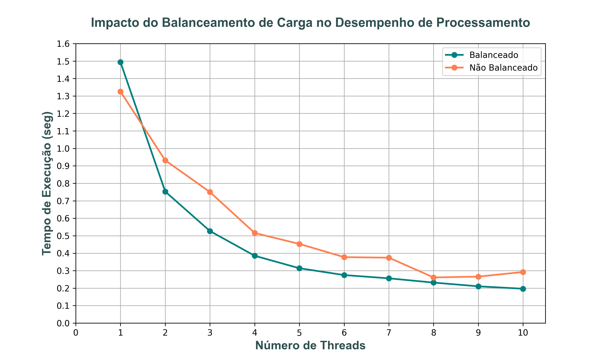

# Exercício de mecanismo de controle para proteger regiões críticas de condições de corrida

### Computação Escalável

> ## Grupo
> 
> - Dominique de Vargas de Azevedo
> - Pedro Thomaz Conzatti Martins
> - Tatiana Lage
> - Thiago Franke Melchiors

## Instruções

1. Execute `primeFinderExample.cpp` em um compilador de **C++**. Este script utiliza multithreading para encontrar números primos e comparar o desempenho de estratégias balanceadas e não balanceadas de distribuição de carga em relação ao tempo de processamento.

2. Execute `graphMaker.py` em um compilador de **python** com os conjuntos de dados `threadsBalanced.csv` e `threadsUnBalanced.csv` gerados em `1` para produzir uma visualização.

    - São necessárias as bibliotecas matplotlib.pyplot, pandas e numpy.

## Visualização

O gráfico a seguir ilustra os resultados obtidos pelo nosso algoritmo, desenhado para salvaguardar regiões críticas contra condições de corrida. Ele contrasta duas abordagens distintas: uma que segmenta a carga de trabalho de forma balanceada, com o intuito de minimizar o tempo total de processamento, e outra que não implementa essa segmentação. Através desta comparação, podemos visualizar a eficácia do balanceamento de carga na otimização do desempenho e na prevenção de gargalos computacionais em operações paralelas.

